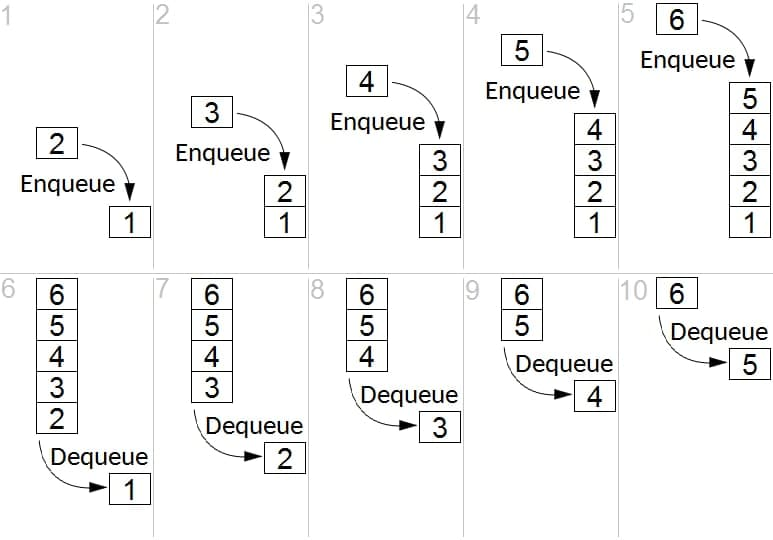
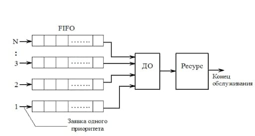
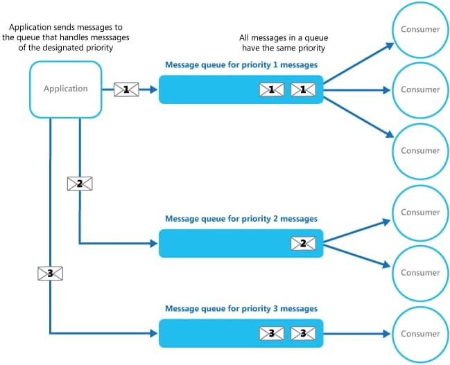

# FIFO-Priority

### Стратегия FIFO

Алгоритм обслуживания очередей First In-First Out (FIFO), также называемый First Come First Served, является самым простым. Пакеты обслуживаются в порядке поступления без какой-либо специальной обработки.

Такая схема приемлема, если исходящий канал имеет достаточно большую свободную полосу пропускания. Алгоритм FIFO относится к так называемым неравноправным схемам обслуживания очередей, так как при его использовании одни потоки могут доминировать над другими и захватывать несправедливо большую часть полосы пропускания. В связи с этим применяются равноправные схемы обслуживания, предусматривающие выделение каждому потоку отдельного буфера и равномерное разделение полосы пропускания между разными очередями.

### Очередь с приоритетами

Очередь с приоритетами (Priority Queuing) - это алгоритм, при котором несколько очередей FIFO (могут использоваться алгоритмы Tail Drop, RED и т. д.) образуют одну систему очередей.

При приоритетной организации очередей (PQ) важный трафик получает самую быструю обработку в каждом пункте, в котором она используется. Этот метод назначает строгий приоритет важного трафика и может обеспечить гибкое задание уровня приоритета в соответствии с сетевыми протоколами. При приоритетной организации очереди каждый пакет помещается в одну из четырех очередей - с высоким, средним и низким приоритетом ожидания - на основе присвоенного приоритета. Назначение разным потокам нескольких разных приоритетов производится по ряду признаков, таких как источник и адресат пакета, транспортный протокол, номер порта. Пакеты, которые не подверглись классификации этим механизмом занесения в список приоритетов, по умолчанию направляются в нормальную очередь. Во время передачи этот алгоритм предоставляет очередям с более высоким уровнем приоритета преференциальный режим по сравнению с очередями с низким уровнем приоритета.

В системах, которые не поддерживают очереди сообщений на основе приоритета, альтернативным решением является создание отдельной очереди для каждого уровня приоритета. Приложение отвечает за отправку сообщений в соответствующую очередь. Каждая очередь может иметь отдельный пул потребителей. В очередях с более высоким приоритетом пул потребителей, работающих на более быстром оборудовании, может быть больше, чем в очереди с более низким приоритетом. На следующем рисунке показано использование отдельных очередей сообщений для каждого уровня приоритета.

Вариация этой стратегии — один пул потребителей, который сначала проверяет сообщения в приоритетных очередях и только затем начинает извлекать сообщения из очередей с более низким приоритетом. Есть некоторые семантические различия между решением, которое использует один пул процессов потребителя (либо с одной очередью, которая поддерживает сообщения с разными приоритетами, либо с несколькими очередями, каждая из которых обрабатывает сообщения с одним приоритетом), и решением, которое использует несколько очередей с отдельным пулом для каждой очереди.
